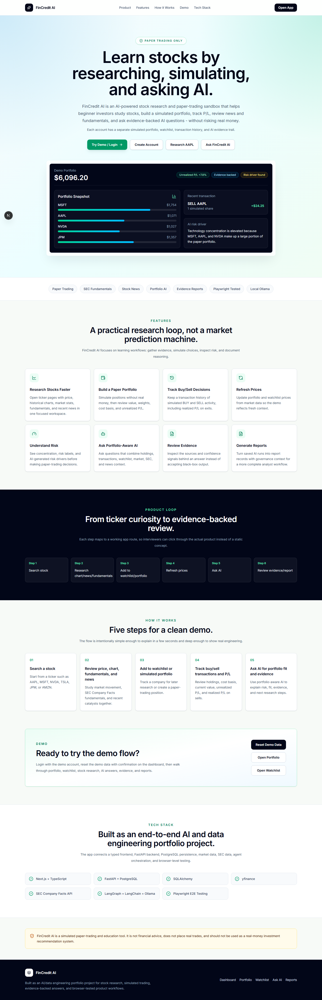
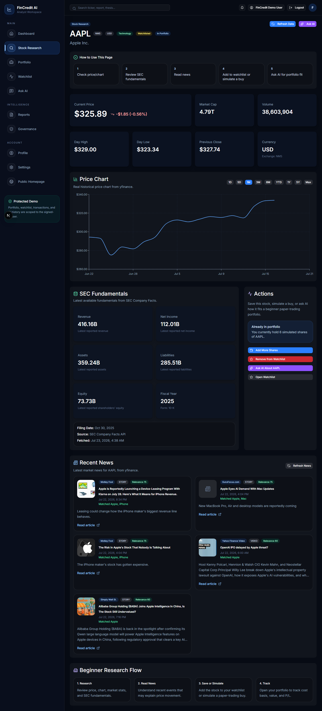
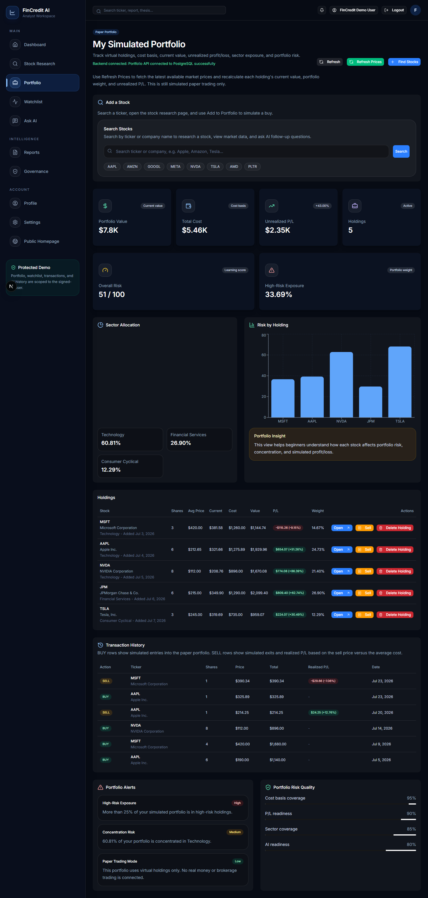
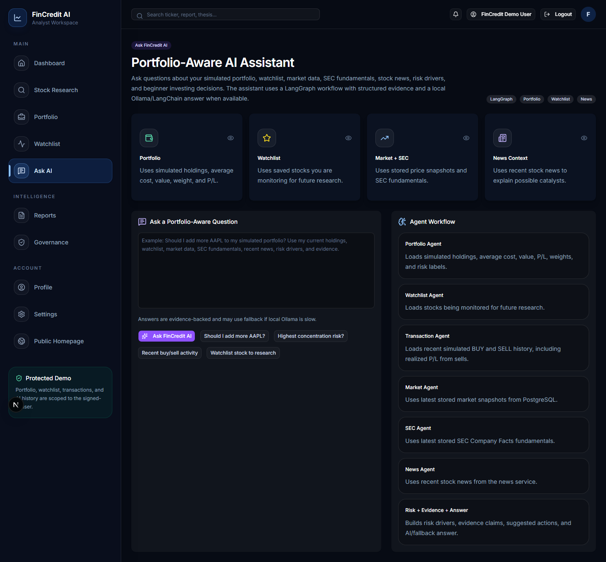

# FinCredit AI

FinCredit AI is a full-stack, beginner-focused stock research and paper-trading MVP. It combines market data, SEC fundamentals, news, user-specific simulated portfolios, watchlists, transaction history, and portfolio-aware AI answers so users can practice research workflows without risking real money.

The public landing page lives at `/`; the protected app workspace starts at `/dashboard`.

## Screenshots

Screenshots can be added later under `docs/screenshots/`.







## Features

- Public SaaS-style landing page and protected internal dashboard
- JWT login/register/profile flows with `user` and `admin` roles
- User-isolated paper portfolios, watchlists, transactions, and AI history
- Stock research pages with market data, price chart, SEC fundamentals, recent news, watchlist actions, paper buy actions, and Ask AI handoff
- Portfolio buy/sell simulation with cost basis, current value, unrealized P/L, realized P/L, weights, and transaction history
- Watchlist refresh workflow for tracked companies
- Portfolio-aware AI questions using portfolio, transactions, watchlist, market, SEC, news, risk, and evidence context
- LangGraph/LangChain/Ollama workflow with deterministic fallback when the local LLM is unavailable or slow
- Generated reports and governance/audit pages
- Read-only admin console for account and usage inspection
- Playwright E2E coverage for the core demo routes
- Docker Compose support for local full-stack running

## Architecture

- `frontend/`: Next.js, TypeScript, Tailwind, shadcn/ui, Recharts, Playwright
- `backend/`: FastAPI, SQLAlchemy, PostgreSQL, JWT auth, LangGraph/LangChain services
- `postgres`: Stores users, holdings, transactions, watchlists, market snapshots, SEC fundamentals, reports, and agent runs
- Data sources: yfinance for market/news data and SEC Company Facts for fundamentals
- AI: local Ollama via LangChain when available, with timeout fallback for stable demos

## Tech Stack

| Layer | Tools |
| --- | --- |
| Frontend | Next.js, TypeScript, Tailwind CSS, shadcn/ui, Recharts |
| Backend | FastAPI, SQLAlchemy, Pydantic Settings |
| Database | PostgreSQL |
| Auth | JWT, passlib[bcrypt], python-jose, bcrypt==4.1.3 |
| AI | LangGraph, LangChain, langchain-ollama, Ollama |
| Data | yfinance, SEC Company Facts API |
| Testing | Playwright, TypeScript, Python compile checks |
| Deployment Prep | Docker, docker-compose, env examples |

## Environment Variables

Copy the examples and edit local values:

```powershell
cd C:\Users\shivk\fincredit-ai\backend
Copy-Item .env.example .env

cd C:\Users\shivk\fincredit-ai\frontend
Copy-Item .env.example .env.local
```

Important backend variables:

- `DATABASE_URL`
- `FRONTEND_URL`
- `CORS_ALLOWED_ORIGINS`
- `JWT_SECRET_KEY`
- `ACCESS_TOKEN_EXPIRE_MINUTES`
- `DEMO_USER_EMAIL`
- `DEMO_USER_PASSWORD`
- `ADMIN_USER_EMAIL`
- `ADMIN_USER_PASSWORD`
- `OLLAMA_MODEL`
- `LLM_TIMEOUT_SECONDS`

Important frontend variable:

- `NEXT_PUBLIC_API_BASE_URL`

## Local Setup

Backend:

```powershell
cd C:\Users\shivk\fincredit-ai\backend
.\venv\Scripts\Activate.ps1
.\venv\Scripts\python.exe -m pip install -r requirements.txt
.\venv\Scripts\python.exe -m app.db.phase_40l_auth_migration
.\venv\Scripts\python.exe -m uvicorn app.main:app --reload
```

Frontend:

```powershell
cd C:\Users\shivk\fincredit-ai\frontend
npm install
npm run dev
```

Open:

```text
http://localhost:3000/
```

## Docker

Start the full local stack:

```powershell
cd C:\Users\shivk\fincredit-ai
docker compose up --build
```

If the database is new, run the auth/demo setup inside the backend container:

```powershell
docker compose exec backend python -m app.db.phase_40l_auth_migration
```

Docker uses local demo secrets only. Ollama is not included in the compose stack, so Ask AI may use the deterministic fallback unless the backend can reach a local/model service.

## Demo Credentials

Local demo only:

- Demo user: `demo@fincredit.ai` / `DemoPass123!`
- Admin user: `admin@fincredit.ai` / `AdminPass123!`

## Demo Script

Use [DEMO_SCRIPT.md](DEMO_SCRIPT.md) for a recruiter/interviewer walkthrough.

Short flow:

1. Open `/`.
2. Login as the demo user.
3. Reset demo data from `/dashboard`.
4. Research `AAPL`.
5. Add to watchlist and portfolio.
6. Open `/portfolio`, refresh prices, sell a small amount, and review transaction history.
7. Ask AI about AAPL and show evidence/risk/fallback status.
8. Generate or review a report.
9. Login as admin and show `/admin`.

## Testing

```powershell
cd C:\Users\shivk\fincredit-ai\backend
.\venv\Scripts\python.exe -m compileall app

cd C:\Users\shivk\fincredit-ai\frontend
npx tsc --noEmit
npm run build
npm run test:e2e
npm run test:e2e:headed
npm audit
npm outdated
```

See [frontend/TESTING.md](frontend/TESTING.md) for smoke commands and troubleshooting.

## Deployment

See [DEPLOYMENT.md](DEPLOYMENT.md) for Docker, non-Docker, CORS, PostgreSQL, JWT, migration, and pre-deployment checklists.

Production reminders:

- Set `APP_ENV=production`.
- Replace `JWT_SECRET_KEY` with a long random value.
- Do not commit `.env` or `.env.local`.
- Use HTTPS end to end.
- Set `CORS_ALLOWED_ORIGINS` to exact production frontend origins.
- Set `NEXT_PUBLIC_API_BASE_URL` before building the frontend.
- Decide whether `/api/demo/reset` should be disabled or further protected.
- Treat localStorage JWT storage as an MVP/demo approach, not final production auth hardening.

## Dependency Audit Note

Final review found 10 frontend advisories: 5 moderate and 5 high. Affected packages include `next`, `postcss`, `sharp`, `brace-expansion`, `fast-uri`, `hono`, `@hono/node-server`, `@modelcontextprotocol/sdk`, `js-yaml`, and `shadcn`.

`npm audit fix --dry-run` showed that the non-force fix would still change `shadcn` and remove several transitive packages. Forced fixes would move framework/tooling dependencies such as Next.js and shadcn. Fixes are deferred to keep the final MVP stable until those dependency changes can be regression tested intentionally.

## Known Limitations

- Paper trading only; no brokerage integration and no real orders.
- Not financial advice.
- yfinance availability and data quality can affect market/news refreshes.
- SEC Company Facts coverage varies by ticker and fact availability.
- Local Ollama can be slow or unavailable; deterministic fallback is expected.
- localStorage JWT storage is intentionally simple for the local MVP.
- Docker Compose does not run Ollama by default.

## Roadmap

- Phase 41: cloud deployment and portfolio launch
- Hosted LLM option for production environments
- Real-time or scheduled price refresh worker
- Richer allocation analytics and risk explanations
- OAuth/social login and production-grade session strategy
- Screenshot capture and portfolio case-study writeup

## Resume Bullets

- Built a full-stack AI-powered paper-trading research platform with Next.js, FastAPI, PostgreSQL, market data, SEC fundamentals, and portfolio-aware AI workflows.
- Implemented JWT authentication, user-specific portfolio/watchlist/transaction isolation, demo reset tooling, and a read-only admin dashboard for account and usage inspection.
- Integrated LangGraph/Ollama fallback AI, yfinance, SEC Company Facts, report/governance views, Playwright E2E tests, environment-based config, and Docker deployment prep.

## Disclaimer

FinCredit AI is a simulated paper-trading and education tool. It is not financial advice, does not recommend real-money trades, and does not place real orders.
