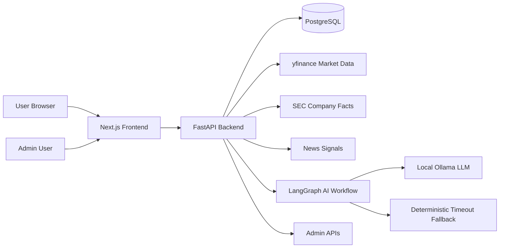

# FinCredit AI Architecture

## High-Level Architecture

FinCredit AI is a full-stack local/demo-ready MVP built around a Next.js frontend, FastAPI backend, PostgreSQL database, external market/fundamental data sources, and a LangGraph AI workflow.

The frontend handles the user experience: public landing page, auth screens, protected dashboard, stock research pages, paper portfolio, watchlist, Ask AI, reports, governance, profile, and admin console.

The backend handles auth, user-specific data access, market/news/SEC integration, portfolio/watchlist actions, report history, governance data, admin summaries, and AI orchestration.

PostgreSQL stores durable application state. External data sources enrich research workflows. LangGraph coordinates the AI response pipeline, with local Ollama when available and deterministic fallback when the LLM is unavailable or slow.

## Request Flow

1. The user opens the Next.js frontend in the browser.
2. The frontend calls FastAPI through `NEXT_PUBLIC_API_BASE_URL`.
3. FastAPI validates auth when required.
4. FastAPI reads/writes PostgreSQL through SQLAlchemy.
5. Market and news routes call yfinance.
6. SEC routes resolve CIKs and call SEC Company Facts.
7. Ask AI routes gather database and market context, then run the LangGraph workflow.
8. LangGraph calls local Ollama when available.
9. If Ollama times out or is unavailable, the backend returns a deterministic fallback answer.
10. The frontend renders results, warnings, evidence, risk drivers, and audit status.

## Auth Flow

### Login/Register

- Users register or login through frontend auth pages.
- FastAPI validates credentials.
- Passwords are handled server-side.
- The backend returns a JWT access token and user profile.

### JWT

- The frontend stores the JWT in localStorage as an MVP/demo approach.
- API helpers attach `Authorization: Bearer <token>` for protected requests.
- A `401` response clears local auth state.

### Protected Routes

- Protected app routes check the current session.
- Admin routes require an admin role.
- Logged-out users are redirected to login.
- Non-admin users see access denied on admin pages.

### User-Specific Data

Authenticated backend services scope data to the current user:

- Portfolio holdings
- Watchlist entries
- Transactions
- AI runs
- Reports

## Stock Research Flow

1. User searches for a ticker or company.
2. Frontend calls `GET /api/stocks/search?q={query}&limit=10`.
3. Backend searches SEC's company ticker universe and local popular-stock fallback.
4. User selects a ticker or manually submits a ticker.
5. Frontend navigates to `/stock/{ticker}`.
6. Stock page requests market data, SEC fundamentals, SEC history, chart data, news, watchlist status, and portfolio status.
7. Market data loads through yfinance when valid.
8. SEC fundamentals load when CIK mapping and Company Facts are available.
9. If SEC data is unavailable, the fundamentals card shows a section-level warning.
10. Chart, news, watchlist, portfolio, and Ask AI actions remain visible.

## Portfolio Flow

### Buy

- User opens a stock page and simulates a buy.
- Backend creates or updates a portfolio holding.
- Backend writes a BUY transaction.
- No real order is placed.

### Sell

- User opens the portfolio sell form.
- Backend reduces shares and records realized P/L for the simulated sell.
- Backend writes a SELL transaction.
- Holdings update without contacting a brokerage.

### Transaction History

- Transactions are user-scoped.
- Portfolio pages show BUY/SELL rows, simulated share counts, prices, and realized P/L when available.

### Realized/Unrealized P/L

- Unrealized P/L is calculated from current/refreshable prices versus cost basis.
- Realized P/L is recorded on simulated sells.
- Portfolio weights are calculated from current simulated holding values.

### Refresh Prices

- Portfolio and watchlist refresh actions fetch updated market data through yfinance.
- Refreshed values update the app state and improve later AI context.

## Ask AI Flow

1. User submits a question from `/ask` or follows the stock page Ask AI link.
2. Backend detects relevant ticker context when available.
3. Backend gathers portfolio context.
4. Backend gathers transaction context.
5. Backend gathers watchlist context.
6. Backend gathers market context.
7. Backend gathers SEC context when available.
8. Backend gathers news context.
9. LangGraph builds risk drivers and evidence records.
10. LangGraph attempts local Ollama generation through LangChain.
11. If Ollama is slow or unavailable, deterministic timeout fallback returns a stable answer.
12. Backend stores the AI run and returns answer, evidence, risk, audit, and metadata.

Missing SEC fundamentals do not crash the AI flow. The answer can still use portfolio, transactions, watchlist, market data, and news. When SEC context is missing, the output can state that SEC fundamentals were unavailable for the ticker.

## Admin Flow

1. Admin user logs in.
2. Frontend verifies the admin role.
3. Admin opens `/admin`.
4. Backend returns read-only user and usage summaries.
5. Admin can inspect user-level details such as holdings, transactions, watchlist rows, and AI run counts.

The admin dashboard does not expose password hashes, JWTs, or secrets.

## Testing Flow

The project uses several levels of verification:

- Backend compile: `python -m compileall app`
- Frontend typecheck: `npx tsc --noEmit`
- Production build: `npm run build`
- E2E tests: `npm run test:e2e`
- Screenshot capture: `npm run screenshots`
- Manual API smoke checks for health, stock search, SEC fundamentals, portfolio, watchlist, and Ask AI

Playwright covers the main recruiter demo surfaces: landing, auth, dashboard, portfolio, watchlist, stock research, Ask AI, reports, governance, admin, and screenshot generation.

## Mermaid Diagram

## Route And Service Map

| Area | Frontend | Backend |
| --- | --- | --- |
| Public entry | `/` | `/api/health` |
| Auth | `/login`, `/register`, `/profile` | `/api/auth/*` |
| Dashboard | `/dashboard` | `/api/dashboard`, `/api/demo/reset` |
| Stock search | Shared `StockSearch` component | `/api/stocks/search` |
| Stock research | `/stock/[ticker]` | `/api/market/*`, `/api/sec/*`, `/api/news/*` |
| Portfolio | `/portfolio` | `/api/portfolio/*` |
| Watchlist | `/watchlist` | `/api/watchlist/*` |
| Ask AI | `/ask` | `/api/ask/*` |
| Reports | `/reports`, `/reports/[reportId]` | `/api/reports/*` |
| Governance | `/governance` | `/api/governance` |
| Admin | `/admin` | `/api/admin/*` |

## Reliability Choices

- SEC ticker mapping uses local fallback plus dynamic SEC mapping.
- SEC failures are section-level on stock pages.
- Ask AI has deterministic fallback when local LLM execution fails or times out.
- Tests avoid exact live market-value assertions because external data changes.
- Demo reset makes the product loop repeatable for interviews.

## Security Notes

- Demo credentials are local/demo only.
- `.env` and `.env.local` should not be committed.
- JWT localStorage is an MVP/demo tradeoff.
- Production deployment should use HTTPS, strong JWT secrets, exact CORS origins, and reviewed demo reset policy.
- This is paper trading only and not financial advice.
